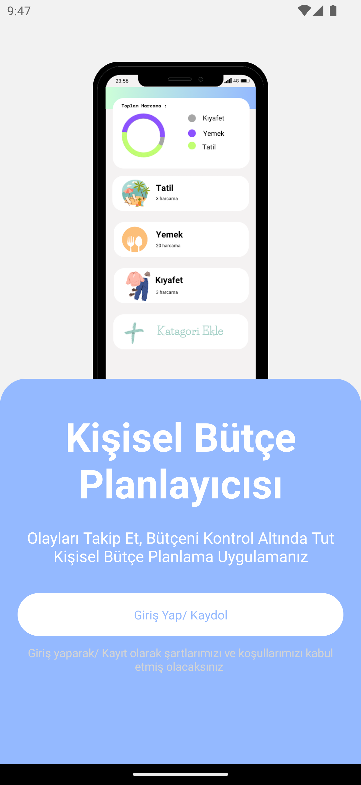
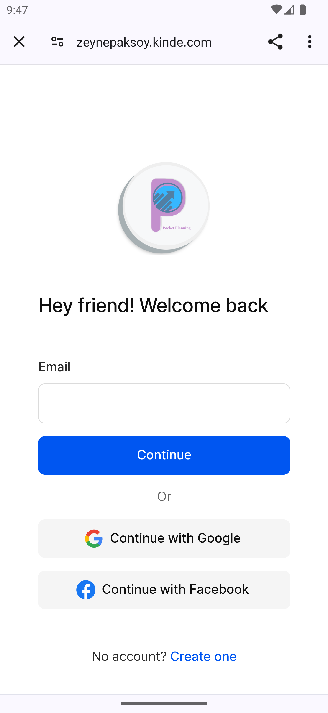
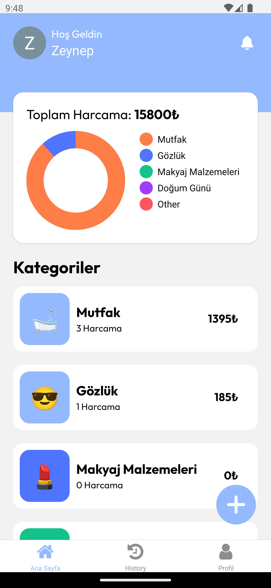
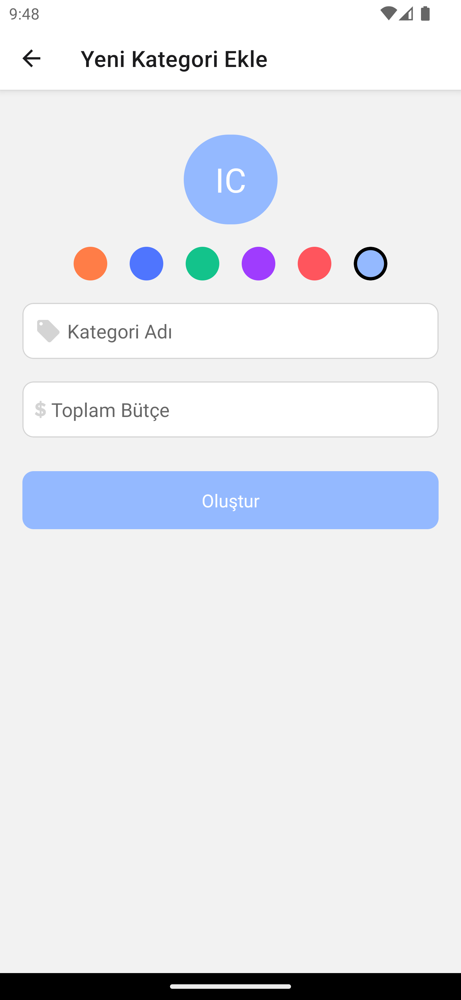
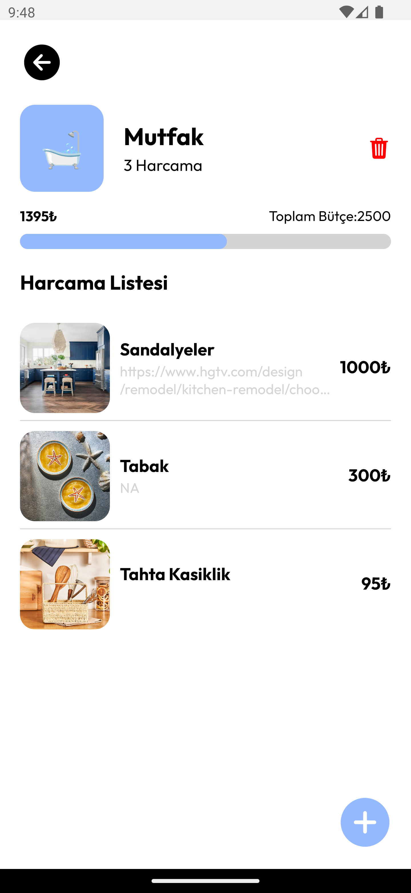
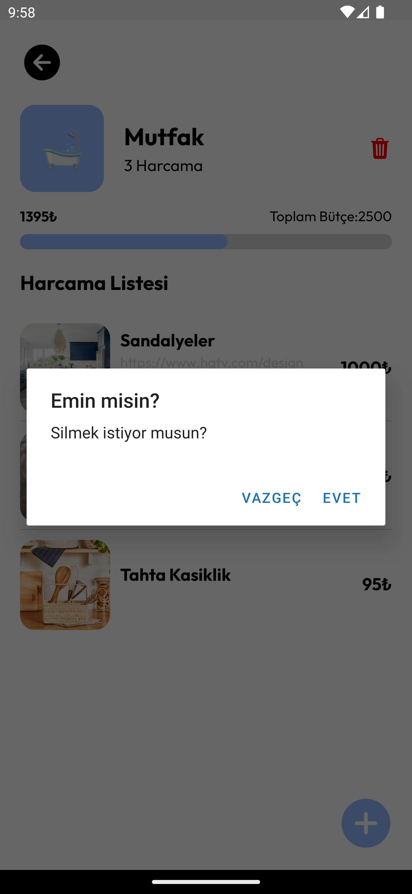
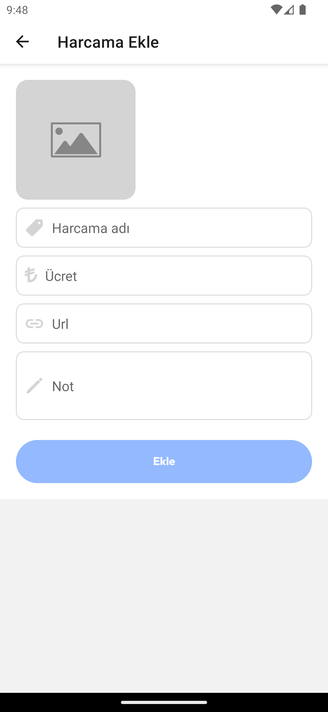
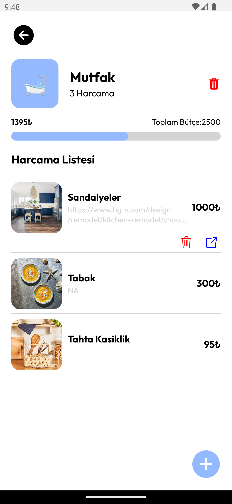

# Pocket Plannig Uygulaması

Bütçe Planlama Uygulaması, kişisel finans yönetimini kolaylaştıran bir mobil uygulamadır. Kullanıcılar, giderleirni etkili bir şekilde izleyebilir, harcamalarını kategorilere ayırabilir ve bütçe hedeflerini belirleyebilirler.

## Özellikler
- Gider ekleme, düzenleme ve silme
- Bütçe hedefleri belirleme
- Harcama oluşturma ve silme
- Katagori oluşturma ve silme
- Grafiklerle harcama analizi

## Kullanılan Teknolojiler
- **React Native:** Uygulamanın kullanıcı arayüzünü oluşturmak için
- **Expo:** React Native uygulamalarını geliştirmek, oluşturmak ve dağıtmak için
- **Kinde:** Kullanıcı kimlik doğrulama ve yönetimi için
- **Supabase:** Veritabanı yönetimi ve gerçek zamanlı veri senkronizasyonu için

## Kurulum ve Çalıştırma
### Gereksinimler
- Node.js ve npm/yarn
- Expo 
- Bir Supabase hesabı ve proje
- Bir Kinde hesabı

### Adımlar
1. Depoyu klonlayın

2. Gerekli paketleri yükleyin:
    npm install

6. Uygulamayı başlatın:
   npx expo start

   ## Ekran Görüntüleri
   1.Giriş 
    <table>
     <tr>
       <td></td>
     </tr>
   </table>

    2.Oturum Açma 
    <table>
     <tr>
       <td></td>
     </tr>
   </table>

    3.Ana Sayfa
    <table>
     <tr>
       <td></td>
     </tr>
   </table>

    4.Katagori Oluşturma 
    <table>
     <tr>
       <td></td>
     </tr>
   </table>

    5.Katagori Sayfası
    <table>
     <tr>
       <td></td>
     </tr>
    </table>

    6.Katagori Silme 
   <table>
     <tr>
       <td></td>
     </tr>
    </table>

    7.Harcama Ekleme 
     <table>
     <tr>
       <td></td>
     </tr>
    </table>
   
    8.Harcama Silme 
     <table>
     <tr>
       <td></td>
     </tr>
    </table>
   

## İletişim
Sorularınız veya geri bildirimleriniz için lütfen [zeynepaksoy853@gmail.com](mailto:zeynepaksoy853@gmail.com) adresinden benimle iletişime geçin.
